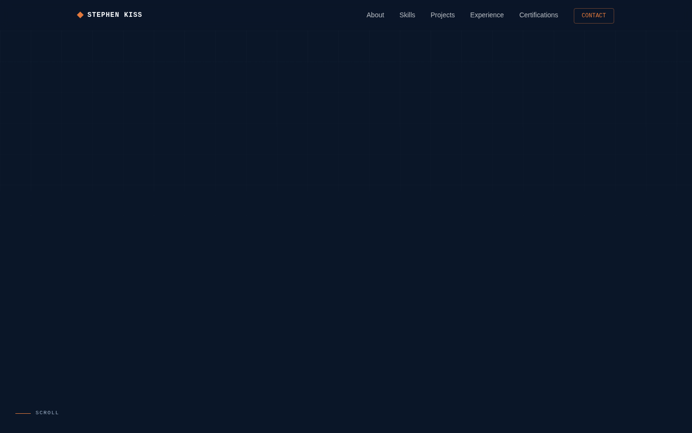
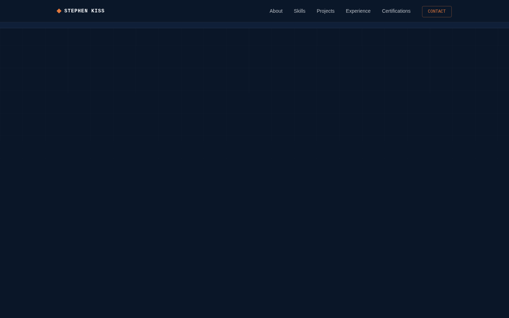
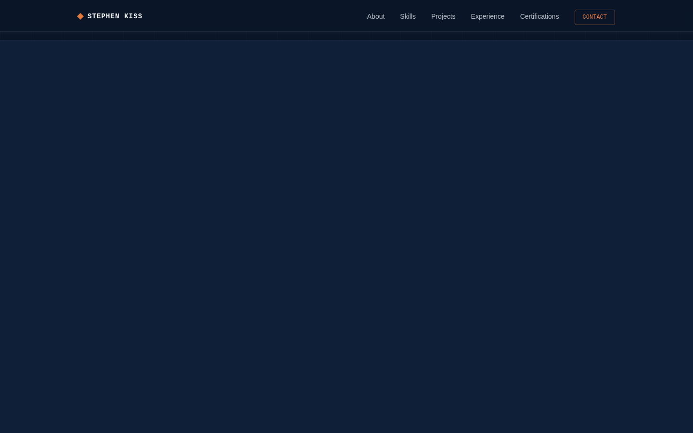
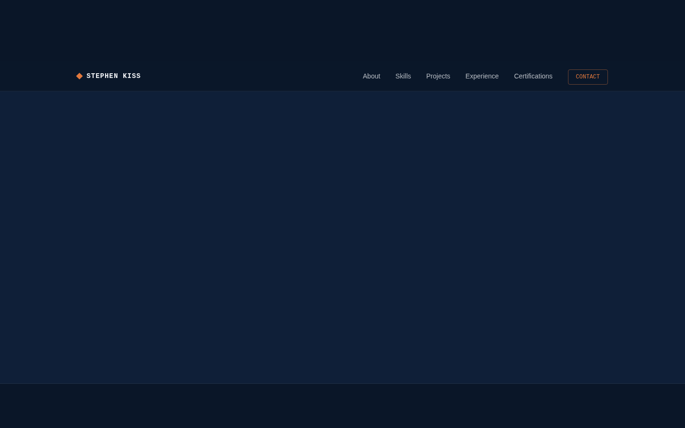
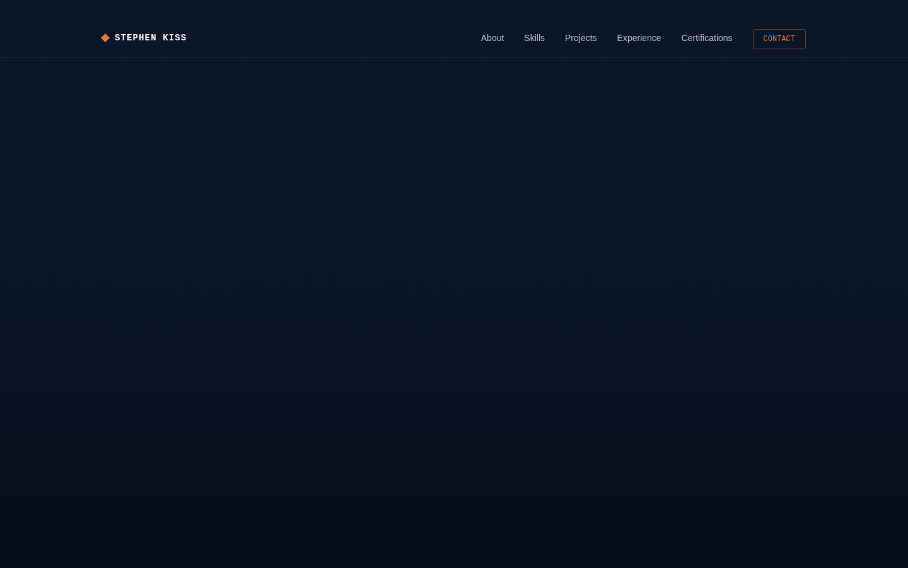

# Stephen Kiss — Manufacturing Data Analyst Portfolio

A modern, responsive personal portfolio site for a Manufacturing Data Analyst
with 15+ years of automotive manufacturing and industrial maintenance
experience, transitioning into data analytics (Excel, SQL, Power BI, Python).

Built with plain **HTML5, CSS3, and vanilla JavaScript** — no frameworks, no
build step, no dependencies to install. Open `index.html` and it runs.

---

## Live Preview

Once deployed (see below), your site will be reachable at:

```
https://<your-github-username>.github.io/<repository-name>/
```

## Screenshots

| Hero | About | Skills |
|---|---|---|
|  |  |  |

| Projects | Experience | Certifications |
|---|---|---|
|  |  |  |

| Contact | Mobile |
|---|---|
|  |  |

---

## Design System

- **Concept:** "Shop-floor blueprint" — a technical-drawing aesthetic that
  nods to spec sheets, gauge readouts, and equipment nameplates, paired with
  a clean, modern layout so it still reads as a polished analytics
  portfolio rather than a novelty theme.
- **Color:** deep navy (`#0A1628`) background, off-white (`#F4F6F9`) text,
  muted industrial orange (`#E2793D`) as the single accent color, used
  sparingly (status dots, links, section eyebrows, card highlights).
- **Type:**
  - **Big Shoulders Display** — headlines and section titles (condensed,
    industrial, signage-like)
  - **Inter** — body copy
  - **IBM Plex Mono** — spec-sheet labels, stats, and "DOC-00X" eyebrows
- **Signature element:** an animated oscilloscope-style "signal line" on the
  hero canvas, evoking an equipment uptime/vibration trace, plus
  technical-drawing corner brackets that appear on project cards on hover.

---

## Tech Stack

| Layer | Technology |
|---|---|
| Markup | Semantic HTML5 |
| Styling | CSS3 (custom properties, Grid, Flexbox, no framework) |
| Interactivity | Vanilla JavaScript (ES6+, no libraries) |
| Fonts | Google Fonts (Big Shoulders Display, Inter, IBM Plex Mono) |
| Hosting | GitHub Pages (or any static host) |

**Features implemented:**
- Sticky navigation bar with scroll-state styling
- Mobile hamburger menu with animated icon
- Scroll-triggered reveal animations (`IntersectionObserver`)
- Animated hero canvas signal line (`prefers-reduced-motion` aware)
- Smooth scrolling to in-page sections
- Back-to-top button
- Fully responsive layout (desktop → tablet → mobile)
- SEO meta tags (title, description, keywords, Open Graph)
- Custom SVG favicon
- Visible keyboard focus states for accessibility
- Clean, commented code throughout

---

## Folder Structure

```
portfolio/
├── index.html                  # All page markup and content
├── css/
│   └── style.css                # Design tokens, layout, components, responsive rules
├── js/
│   └── script.js                 # Nav, scroll reveal, back-to-top, hero canvas animation
├── assets/
│   ├── favicon.svg               # Custom SVG favicon (gear + data bars monogram)
│   ├── Stephen-Kiss-Resume.pdf   # Placeholder — replace with your real resume
│   └── screenshots/              # Images used in this README
└── README.md
```

---

## Content You Should Personalize

This template ships with realistic **placeholder content** — replace the
following before publishing:

| Section | What to edit |
|---|---|
| Hero | `assets/Stephen-Kiss-Resume.pdf` — add your real resume file |
| Certifications | Replace placeholder cert names / issuers / dates with your actual credentials |
| Contact | Update the email address, LinkedIn URL, GitHub URL, and location in `index.html` (`#contact` section) |
| Projects | Swap the `href="#"` placeholders on each project card for your real GitHub repository links |
| Experience | Adjust company names, dates, and descriptions to match your actual work history |

Search `index.html` for `Add ` and `#` to find every placeholder quickly.

---

## Running Locally

No build tools required.

1. Download or clone this folder.
2. Open `index.html` directly in a browser, **or** serve it locally for a
   more production-like experience:

   ```bash
   # Python 3
   python3 -m http.server 8000
   # then visit http://localhost:8000
   ```

---

## Editing in Visual Studio Code

1. Open VS Code → **File → Open Folder…** → select the `portfolio` folder.
2. Install the **Live Server** extension (by Ritwick Dey) for auto-reloading
   while you edit.
3. Right-click `index.html` → **Open with Live Server**.
4. Edit `index.html`, `css/style.css`, or `js/script.js` — the browser
   refreshes automatically on save.
5. Colors, fonts, and spacing are controlled from the `:root` custom
   properties at the top of `css/style.css` — change a value there to
   re-theme the whole site.

---

## Deploying to GitHub Pages

1. **Create a repository** on GitHub (e.g. `portfolio` or
   `stephen-kiss-portfolio`).
2. **Push your local project:**

   ```bash
   cd portfolio
   git init
   git add .
   git commit -m "Initial commit: Manufacturing Data Analyst portfolio"
   git branch -M main
   git remote add origin https://github.com/<your-username>/<repo-name>.git
   git push -u origin main
   ```

3. **Enable GitHub Pages:**
   - Go to your repository on GitHub → **Settings** → **Pages**.
   - Under **Build and deployment → Source**, select **Deploy from a
     branch**.
   - Under **Branch**, select `main` and folder `/ (root)`, then **Save**.
   - Wait 1–2 minutes; GitHub will publish your site at:
     `https://<your-username>.github.io/<repo-name>/`

4. **Custom domain (optional):** In the same **Pages** settings, add your
   domain under **Custom domain** and follow GitHub's DNS instructions.

Every time you `git push` a change to `main`, GitHub Pages redeploys
automatically.

---

## Accessibility & Performance Notes

- Respects `prefers-reduced-motion` — scroll-reveal and the hero canvas
  animation degrade to static states.
- All interactive elements have visible keyboard focus rings.
- Semantic landmarks (`header`, `main`, `section`, `footer`) and heading
  hierarchy support screen readers.
- No external JS frameworks or icon fonts — fast first paint, minimal
  requests (only Google Fonts).

---

## License

Personal portfolio template — free to use and adapt for your own site.
